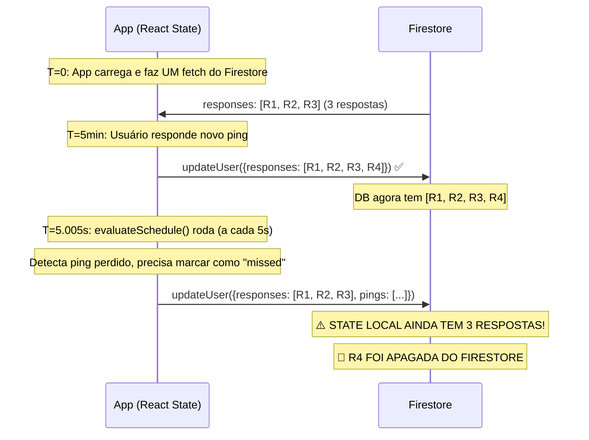

# 🔴 Relatório de Investigação: Dados Desaparecendo do Banco de Dados

**Data:** 17 de Março de 2026  
**Severidade:** CRÍTICA — perda silenciosa de dados de pesquisa  
**Conclusão:** Causa raiz identificada no código. Não é ação manual.

---

## 1. O que foi observado

Comparando duas exportações da coleção `participantes`:
- **Planilha da Esquerda (mais recente):** Dados de respostas estão AUSENTES para vários participantes.
- **Planilha da Direita (mais antiga):** As mesmas respostas existiam anteriormente (marcadas em amarelo).

**Participantes afetados:** JCS, Diamante, Thithi, Captão, Likert, bruninho, Luh R — todos com respostas do dia 17/03/2026 que existiam na exportação anterior e sumiram na mais recente.

---

## 2. Causa Raiz Identificada: Race Condition no `updateUser`

### O Mecanismo Exato da Perda de Dados

O problema é uma **condição de corrida** (race condition) entre a leitura dos dados e a escrita de volta ao Firestore. O fluxo destrutivo acontece assim:



### Os 3 Fatores que Criam o Bug

**Fator 1 — Leitura Única, Sem Sincronização em Tempo Real:**
```typescript
// useParticipante.ts — Faz UM ÚNICO fetch ao montar o componente
useEffect(() => {
    const data = await getParticipanteByUid(user.uid); // <- fetch único
    setParticipante(data); // <- nunca mais atualiza do DB
}, [user, authLoading]);
```
O hook `useParticipante` carrega os dados do Firestore **uma única vez**. Não há `onSnapshot` (listener em tempo real). Se o DB for atualizado por outra fonte (outro dispositivo, outra aba, um script), o estado local fica **obsoleto** (stale).

**Fator 2 — Escrita por Substituição Total do Array:**
```typescript
// UserService.ts — updateUser() SUBSTITUI o array inteiro
const updateData = {
    pings: state.pings,       // <-- SUBSTITUI TUDO
    responses: state.responses, // <-- SUBSTITUI TUDO
    "user.points": state.user.points,
    "user.level": state.user.level,
};
await updateDoc(docRef, updateData);
```
Cada chamada a `updateUser` **substitui o array `responses` inteiro** pelo que está na memória local. Se a memória local não tem a resposta mais recente, ela é silenciosamente apagada.

**Fator 3 — O Gatilho: `evaluateSchedule` Roda a Cada 5 Segundos:**
```typescript
// DashboardPage.tsx — Loop que roda a cada 5s
const intervalId = setInterval(evaluateSchedule, 5000);

// Dentro de evaluateSchedule:
if (result.newlyMissedPings.length > 0) {
    // ... monta newState a partir do estado LOCAL (potencialmente stale)
    await UserService.updateUser(newState); // 🔴 SOBRESCREVE COM DADOS VELHOS
}
```
A cada 5 segundos, o `evaluateSchedule` verifica se algum ping venceu. Se sim, ele pega o `participante` DO ESTADO LOCAL, muda o status do ping para "missed", e chama `updateUser`. **Esse `updateUser` enviará o array `responses` do estado local — que pode estar desatualizado.**

---

## 3. Cenários Concretos de Perda

| Cenário | Probabilidade | Como Acontece |
|---------|--------------|---------------|
| **Duas abas abertas** | Alta | Aba 1 responde ping → Aba 2 (com estado antigo) marca um missed → desapareceu |
| **Dois dispositivos** | Alta | Celular e PC com o app logado no mesmo usuário |
| **Script externo** | Alta | `injectData.ts` roda e sobrescreve `responses` e `pings` inteiros para Captão |
| **Estado stale após longa sessão** | Média | App ficou aberto por horas, outro processo escreveu no DB, evaluateSchedule reescreve com dados velhos |
| **`deleteIniciantes.js`** | Verificar | Deleta documentos INTEIROS de users com nickname "Iniciante" e `hasOnboarded !== true`. Se algum participante real foi pego nesse filtro, todo o documento (não só respostas) sumiu |

---

## 4. Scripts Externos que Manipulam o Banco

| Script | O que faz | Risco |
|--------|-----------|-------|
| `injectData.ts` | **SOBRESCREVE `responses` e `pings`** inteiros para "Captão" com dados fake | 🔴 ALTO — destrói dados reais |
| `deleteIniciantes.js` | Deleta **documentos inteiros** de users com nickname "Iniciante" sem `hasOnboarded` | 🔴 ALTO — remove participantes |
| `fixCaptao.ts` | Atualiza APENAS `user.level` | 🟢 Seguro |
| `fixViaRest.js` | Atualiza APENAS `user.level` via REST | 🟢 Seguro |

---

## 5. Conclusão

**A causa principal é o código do próprio app:** a combinação de fetch único (sem real-time sync) + escrita por substituição total de arrays + loop de 5 segundos que escreve de volta o estado local. Isso cria uma janela de corrida constante onde qualquer write com estado obsoleto apaga respostas mais recentes.

**Contribuição dos scripts:** O `injectData.ts` é especialmente destrutivo para o Captão, pois substitui todas as respostas por dados fake. O `deleteIniciantes.js` pode ter removido documentos inteiros se participantes reais caíram no filtro.

---

## 6. Soluções Recomendadas (Por Prioridade)

### 🔴 Correção Imediata (Curto Prazo)

**1. Nunca sobrescrever `responses` inteiro — usar operações atômicas:**
Em vez de enviar `responses: state.responses` (array completo), usar `arrayUnion` do Firestore para ADICIONAR respostas sem tocar nas existentes. Para marcação de missed pings, atualizar APENAS o campo `pings` sem enviar `responses`.

**2. Separar as escritas de `pings` e `responses`:**
O `evaluateSchedule` (que marca missed pings) deveria atualizar APENAS `pings`, sem tocar em `responses`. Isso elimina a janela de race condition mais perigosa.

### 🟡 Correção Estrutural (Médio Prazo)

**3. Migrar `useParticipante` para usar `onSnapshot`:**
Em vez de um fetch único, usar um listener em tempo real que mantém o estado local sempre sincronizado com o Firestore. O app já faz isso para o leaderboard (`onSnapshot` no `DashboardPage.tsx`).

**4. Apagar ou proteger os scripts destrutivos:**
Mover `injectData.ts` e `deleteIniciantes.js` para um diretório isolado (ex: `scripts/dev-only/`) e nunca executá-los contra o banco de produção sem backup.
